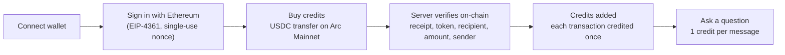

# MicroAI

> Pay-per-use AI assistant for builders on Arc, paid in USDC.

[](https://github.com/sahmedonchain/microai/actions/workflows/ci.yml)
[](https://github.com/sahmedonchain/microai/actions/workflows/github-code-scanning/codeql)

**Live app:** https://microai-tan.vercel.app

**Status:** live on Arc Mainnet. Experimental. Not independently audited.

Built on Arc. MicroAI is an independent project, not an official Arc or Circle product.

## Screenshots

Images are not committed yet. Add these files to [`docs/screenshots/`](docs/screenshots/) and they can be embedded here.

| Page | File to add |
|---|---|
| Chat | `docs/screenshots/chat.png` |
| Copilot | `docs/screenshots/copilot.png` |
| Wallet analysis | `docs/screenshots/wallet.png` |
| Debug | `docs/screenshots/debug.png` |
| Credits | `docs/screenshots/credits.png` |

## What it is

MicroAI answers questions about Arc and Circle and helps with developer tasks such as code generation, wallet lookups and transaction debugging. You pay with prepaid credits bought in USDC on Arc Mainnet. One credit is **0.001 USDC** and covers one chat message or one Copilot request. There is no subscription and credits never expire.

## Features

The app is a single page with a sidebar. Each entry below is a panel in it.

| Page | What it does |
|---|---|
| **Chat** | Answers Arc and Circle questions from a knowledge base of 77 curated entries plus the AI model. 1 credit per message. |
| **Copilot** | Writes Solidity, TypeScript and deploy steps for Arc in 9 modes (Architect, Contract, USDC, Circle, Deploy, Audit, Simulate, Debug, Migrate) plus a general mode. It **generates text only**: it does not compile, test or deploy anything. Long answers can be continued at no extra cost. 1 credit per request. |
| **Wallet** | Look up any address, no sign-in. Native and token balances, the 20 most recent transactions, four rule-based risk signals (unlimited approval, high-value transfer, recent contract call, many transactions in 24 hours) and a short AI summary. |
| **Debug** | Paste a transaction hash. Shows status, token transfers, internal transactions, the decoded function (8 common selectors), a suggested corrected flow and an AI explanation. No sign-in. |
| **Credits** | Balance, USDC payment history, buy more credits, and **Recover a payment**: paste the hash of a USDC payment whose credits did not arrive and the server re-checks it. |
| **Ecosystem** | Directory of 81 Arc and Circle projects in 12 categories with search and filters, an AI search over the same list, and Arc-chain TVL for 5 protocols from DeFiLlama. |
| **Grants** | Hand-maintained list of 23 grants, hackathons, bounties, events and programs. |
| **News** | Arc and Circle news pulled from the Arc and Circle blogs, the Circle pressroom, Google News searches and three finance feeds, filtered for relevance and cached for 30 minutes. |
| **Stats** | Latest block, gas price and estimated cost of a transfer, plus USDC received and transaction counts for the MicroAI payment wallet, read from the chain. |
| **Build status** | Last activity of 24 tracked GitHub repositories, plus an on-chain check of the AchSwap contracts. |

Credit packs are 5, 10, 20 or 50 credits, or any number from 1 to 1000.

## How it works



The browser never decides what was paid. The server reads the transaction receipt from Arc, checks it and then adds credits. If the confirmation is slow or the tab is closed, the transaction hash is kept in the browser and verified again on the next visit.

## On-chain details (Arc Mainnet)

Source: [docs.arc.io](https://docs.arc.io/arc/references/connect-to-arc).

| Item | Value |
|---|---|
| Chain ID | `5042` (`0x13b2`) |
| RPC | https://rpc.mainnet.arc.io |
| Explorer | https://explorer.arc.io |
| USDC | `0x3600000000000000000000000000000000000000` |
| EURC | `0xbEf5f6d51CB62b58e6A8f77868681825C6fe21c1` |
| MicroAI payment wallet | `0x78C144A76614A8674285129810555C8bCa78f044` |

USDC is the gas token on Arc. The native balance uses 18 decimals and the USDC ERC-20 interface uses 6 decimals, so amounts are 6-decimal units (1 credit = 1000 units). All addresses live in one registry, [`lib/arcAddresses.ts`](lib/arcAddresses.ts), with the network and docs page for each. Arc Testnet (chain ID `5042002`) has its own addresses and a faucet at https://faucet.circle.com; MicroAI itself only runs on Mainnet.

## Security

Implemented controls:

- **Sign-in:** Sign-In with Ethereum (EIP-4361) bound to the app domain and Arc Mainnet chain ID. Nonces are stored in Redis, expire after 5 minutes and work once.
- **Payments:** verified on the server from the Arc receipt: the RPC is checked to be Arc Mainnet, the transaction succeeded, and every USDC transfer in it is read. Transfers from the signed-in wallet to the MicroAI wallet are summed and must match the amount. Each transaction hash can be credited once, enforced atomically in Redis. Payments are verifiable for 7 days.
- **Credits:** never expire.
- **Headers:** HSTS, `X-Frame-Options: DENY`, `nosniff`, a strict referrer policy and a permissions policy on every response. A Content-Security-Policy is sent in report-only mode.
- **Abuse limits:** Redis sliding-window rate limits on every API route, keyed by wallet or IP, plus daily caps on the public AI endpoints.
- **Input handling:** request bodies and queries are validated with zod. Chat history from the browser is validated, and third-party text (token symbols, explorer fields) is fenced as data before it reaches the model.
- **Keys:** the app never asks for a private key or seed phrase.
- **Tests:** 176 tests in 17 files cover sign-in, payment verification, replay and recovery, rate limiting, prompt handling and the navigation config. Redis, the chain RPC and the AI provider are mocked in these tests and the files say so.

Known limitations:

- Experimental and not independently audited. Do not rely on it for large amounts.
- AI answers can be wrong. Check addresses and parameters against [docs.arc.io](https://docs.arc.io) before sending funds.
- Copilot output is not compiled or tested. Review and test generated code yourself.
- The ecosystem and grants lists are curated by hand and are not independently verified.
- Wallet, Debug and ecosystem search are public and rate limited, so they can return `429`.
- Chain data comes from the Arc RPC and the Arc Explorer API and is unavailable when they are.

To report a vulnerability, see [SECURITY.md](SECURITY.md).

## Tech stack

| Area | Choice |
|---|---|
| App | Next.js 16 (App Router), React 19, TypeScript 5, Tailwind CSS 4, Framer Motion |
| AI | Groq with `openai/gpt-oss-120b` |
| Storage | Upstash Redis (credits, nonces, claims, rate limits, caches) |
| Wallets | Browser wallets through the injected EIP-1193 provider (MetaMask, Coinbase Wallet, Trust Wallet, Brave Wallet); `ethers` 6 verifies signatures on the server |
| Validation | zod 4 |
| Tests | Vitest 5 |
| Package manager | pnpm |
| Hosting | Vercel |

## Local development

Requires Node 22 (the version CI uses), pnpm, a [Groq](https://console.groq.com) API key and an [Upstash Redis](https://upstash.com) database.

```bash
git clone https://github.com/sahmedonchain/microai.git
cd microai
pnpm install
cp .env.example .env.local   # then fill in the values
pnpm dev                     # http://localhost:3000
```

| Variable | Required | Used for |
|---|---|---|
| `GROQ_API_KEY` | yes | AI answers |
| `UPSTASH_REDIS_REST_URL` | yes | Redis |
| `UPSTASH_REDIS_REST_TOKEN` | yes | Redis |
| `SESSION_SECRET` | yes | Signing session cookies (use a long random string) |
| `GITHUB_TOKEN` | no | Higher GitHub rate limit for Build status |
| `SIWE_DOMAIN` | no | Pins the sign-in domain; defaults to the request host |

Buying credits needs an injected wallet on Arc Mainnet with USDC.

## Testing and CI

```bash
pnpm test                          # Vitest
pnpm exec eslint app lib tests     # lint
pnpm exec tsc --noEmit             # typecheck
pnpm build                         # production build
```

[GitHub Actions](.github/workflows/ci.yml) runs install, lint, typecheck, tests and build on every push and pull request. GitHub CodeQL scans the code for security issues.

## Roadmap

- Payment hardening
- Monitoring
- A public `/security` page
- Transaction Intelligence 2.0
- Wallet Intelligence
- Ecosystem Directory 2.0

## Author

Built solo by **Sahmed Zayan** ([@sahmedonchain](https://x.com/sahmedonchain)) under [BuildOrbit](https://github.com/sahmedonchain).

## Links

- [GitHub](https://github.com/sahmedonchain/microai)
- [Arc docs](https://docs.arc.io)
- [Arc Explorer](https://explorer.arc.io)
- [Circle developer docs](https://developers.circle.com)
